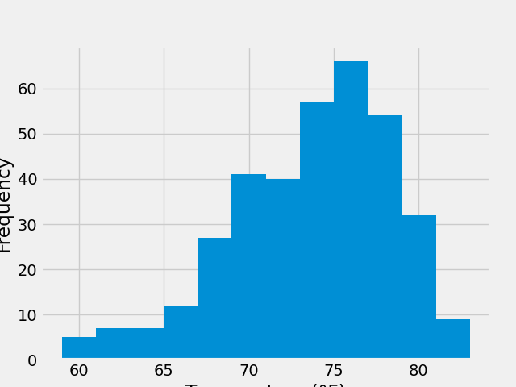
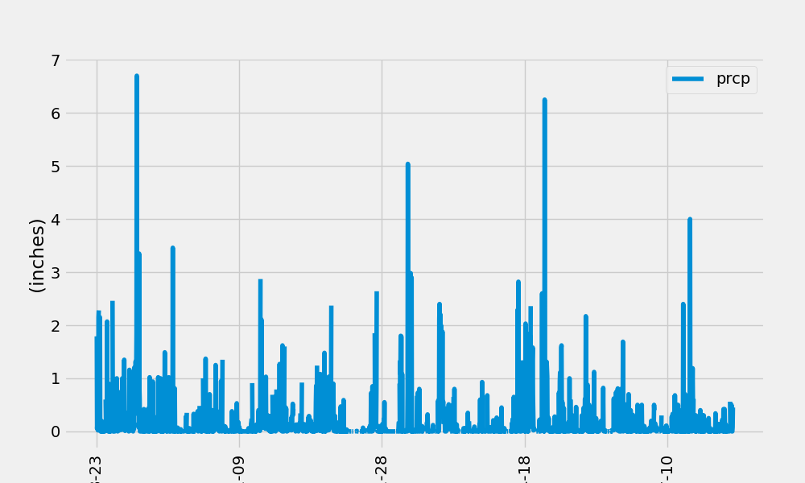

# sqlalchemy-challenge

This Visual code performs an analysis of weather data from a SQLite 
database using SQLAlchemy and pandas. Here is a breakdown of the code:

It starts by importing the necessary libraries for data manipulation and 
visualization, such as matplotlib, numpy, and pandas.
The code then establishes a connection to the SQLite database file 
"hawaii.sqlite" using SQLAlchemy.
The database tables are reflected into SQLAlchemy's ORM (Object Relational 
Mapper) using the automap_base function. This allows accessing the tables 
as Python classes.
The classes measurement and station are assigned to references for easier 
querying later.
A session is created to establish a link between Python and the database.
The code performs exploratory precipitation analysis:
*  A.	The most recent date in the dataset is obtained using a query with 
func.max() and scalar().
  B.	The date one year before the most recent date is calculated using 
the datetime module and timedelta.
C.	A query retrieves the date and precipitation scores for the last 
12 months of data using filter().
D.	The query results are saved as a pandas DataFrame, sorted by date, 
and plotted using df.plot().
E.	The summary statistics for the precipitation data are calculated 
using df.describe().

Next, the code performs exploratory station analysis:
A.	The total number of stations in the dataset is calculated using 
func.count() and scalar().
B.	The most active stations are determined by counting the rows for 
each station, grouping by station, and ordering in descending order.
C.	The lowest, highest, and average temperature for the most active 
station (USC00519281) are calculated using func.min(), func.max(), and 
func.avg() with a filter on the station ID.
D.	The last 12 months of temperature observation data for the most 
active station are queried and plotted as a histogram.

Finally, the code closes the session.
Note: The code includes saving the precipitation plot as "prcp.png" and 
the temperature histogram as "frequency.png" using plt.savefig().

